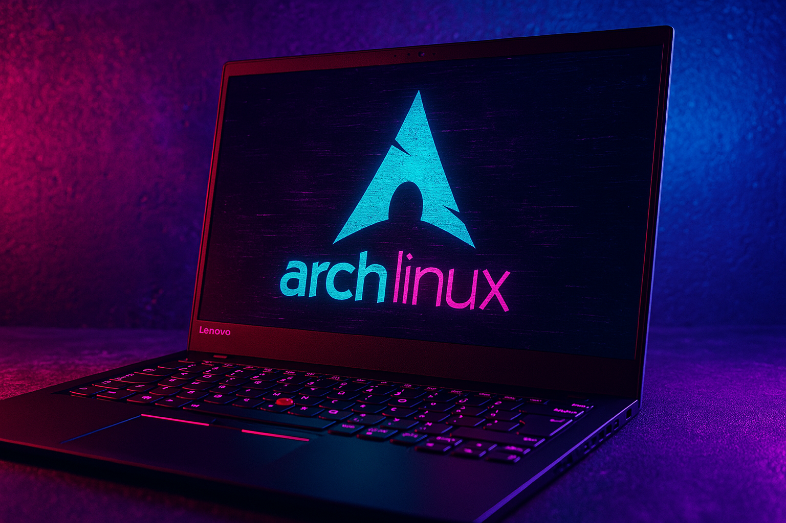

# Arch Linux Installation 

### Lenovo ThinkPad X1 Carbon Gen 12 



This writeup explains how to install Arch Linux in a brand new Lenovo Thinkpad X1 Carbon Gen 12 computer without deleting the Windows installation or the recovery partitions. The specifications and installation decisions chosen for the installation are listed down below.

## Computer Specs

- **CPU**: Intel Ultra 7 165U vPro
- **Display**: 14" OLED 2.8K Non-Touch Anti-Glare Display
- **RAM**: 64GB 6400MHz
- **Drive**: 1TB Gen4 Performance SSD
- **Base OS**: Win 11 Pro

## Overal System Installation Decisions

- Dual boot Arch and Windows.
- Will **NOT** support Fast Startup or Hibernate (Suspend to Disk).
- Will configure Windows Encryption with Bitlocker.
- Will use an unencrypted boot partition for EFI / GPT.
- Will use an encrypted LUKS partition with a BTRFS filesystem within it with:
  - An encrypted subvolume for the Swap partition
  - An encrypted subvolume for the root partition.
- I won't create a subvolume for `/home` since most of my data is stored in a private NAS. Another common option is ext4 but BTRFS has support for subvolumes, snapshots and other features.
- Will use the [rEFInd](https://www.rodsbooks.com/refind/) boot manager. Other options could be GRUB or LILO.
- Will use the Desktop Environment from the [gh0stzk dotfiles](https://github.com/gh0stzk/dotfiles).
- The dotfiles are based on bspwm, sxhkd, polybar, rofi, eww, alacritty, kitty, and other tools.

## Free up Space for the new OS in Windows

In Windows, manage the partition with Disk Management (`diskmgmt.msc`)

- Run `diskmgmt.msc` as Administrator.
- Right click on the "`(C:)`" partition (the only one of the default Windows-created partitions which can be resized online) and select "_Shrink Volume_".
- Enter the size wanted (I took `500 GB` from it) as the amount to shrink and click "_Shrink_".
- There should now be `500 GB` of unallocated space after the "`(C:)`" partition.

## Disable Fast Startup and Disable hibernation

Reference: https://wiki.archlinux.org/title/Dual_boot_with_Windows

Fast Startup comes by default in Windows 11 and means the shut-down behavior is not shutting down but instead hibernating. Hibernation can corrupt the data if the NTFS disk is mounted from linux while windows was hibernated so the safest choice is to disable it.

- Type:
```
powercfg /H off
```
- Shut Down the system (don't use reboot, you have to shut down).

## Enable Bitlocker Encryption and Save Recovery Key

- Press the Start key and write "_Manage Bitlocker_".
- Where it says "_Operating System Drive_", click on "_Turn on Bitlocker_".
- Here we need to save the recovery key. The option "_Save to file_" requires an encrypted destination, so instead we'll go the printing route and save to PDF which allows to easily manipulate the key.
- In the recovery key menu, select "_Print the recovery key_". This will print the ID and the key, you can print it to PDF and from there temporarily copy and paste both the ID and Key into txt files. We'll  use this for recovery or to configure Linux to decrypt the partition.
- Finally, click on "_Activate Bitlocker_".
- Shut Down the system.

## Arch Linux ISO Download

- Download the ISO image from https://archlinux.org/download/.
- Verify signature, don't skip this step since it is very easy to get a corrupted image.
- Download the SHA256 signature from a path like https://archlinux.org/iso/2025.03.01/sha256sums.txt
- Get the signature of the downloaded file in Windows with the following command:

```
certutil -hashfile archlinux-2025.03.01-x86_64.iso SHA256
```

- Confirm the returned value matches the one in the `sha256sums.txt` file.

## Create Bootable Flash Drive.

- Download Rufus for Windows from https://rufus.ie/en/ and install on Windows.
- Plug the flash drive into the USB port (the flash drive content will be deleted).
- In Rufus, just pick the ISO image and select the flash drive to create the Arch Linux Bootable flash drive.
- This can be done in other ways or programs listed in https://wiki.archlinux.org/title/USB_flash_installation_medium.

## Disable Secure Boot

The X1 has UEFI and Secure Boot enabled. To be able to boot from the Flash Drive with Arch it is first required to disable Secure Boot because it's not currently supported.

- Turn on the Computer and when the red Lenovo logo appears wait until a message appears down below stating: To interrupt normal startup press "Enter". Press it and then press `F1` to go to the UEFI menu.

- Go to the "Security" menu, then "Secure Boot", then turn it off.

- Press `F10` to save and Exit.

## Boot into the Arch Flash Drive

- Repeat the steps to enter UEFI with Enter when Lenovo Red Logo is shown but then press `F12` to select the Boot Menu.

- In the menu, select the Flash Drive to boot up.

- If everything went well, the Arch Menu will be presented. Choose the first option: Arch Linux install medium (x86_64, UEFI).

- The system will start to boot and this should end up with an operational root terminal.

## Configure Keyboard and Internet Access

- Configure the keyboard layout:

```
loadkeys us-acentos
```

- Verify the boot mode with the UEFI bitness and confirm it returns `64`, which indicates the system is booted in UEFI mode and has a 64-bit x64 UEFI:

```
cat /sys/firmware/efi/fw_platform_size
```

- Connect to the internet

  - Use `ip link` to check there is a `wlan0` interface to connect through WiFi.
  - Use the `iwctl` to enter the Network Configuration Tool.
  - Use `station wlan0 connect MyNetwork` to connect to the Network named "_MyNetwork_".
  - Use `exit` to exit `iwd` and then `ping www.google.com` to check there is internet connection.

## Resize the EFI System Partition (ESP)

Docs: https://wiki.archlinux.org/title/EFI_system_partition#Replace_the_partition_with_a_larger_one

- The EFI system partition is smaller than recommended 1GB. E.g. Windows Setup creates a measly 260 MiB EFI system partition. We need to create a new, larger EFI system partition to prevent running out of space on it.

- Confirm that The EFI System partition is located in `/dev/nvme0n1p1` using `fdisk -l`. The rest of the commands will consider as a fact that the partition lives in `/dev/nvme0n1p1`.

- Mount the ESP, back it up, and unmount it:

```
mkdir /mnt/esp
mount /dev/nvme0n1p1 /mnt/esp
cp -a /mnt/esp /esp_backup
umount /mnt/esp
```

- Run `blkid` and take note of the `UUID` and `PARTUUID` values. They will later be reused for the new partition.

```
blkid
blkid > /esp_backup/blkid.txt
```

- Delete the old partition using `sgdisk` from `gptfdisk`. If the EFI lives in the partition number 1 (e.g.`nvmen0p"1"`), this is set with the `--delete=1` parameter, and the next parameter is for the device `/dev/nvme0n1`:

```
sgdisk --delete=1 /dev/nvme0n1
```

- Create a new `4 GB` partition reusing the old `PARTUUID` and `PARTLABEL` (replace the `YYYYYY` in the `partition-guid`). `--align-end` means we put the `0` pointer in the last sector. From there we use `--new=0:-4G:0` which means use partition number `0`, starting `4 GiB` before the last sector (the minus) until `0` which is the last sector.

```
sgdisk --align-end --new=0:-4G:0 --typecode=0:ef00 --change-name=0:'EFI system partition' --partition-guid=0:YYYYYYYY-YYYY-YYYY-YYYY-YYYYYYYYYYYY /dev/nvme0n1
```

- Check the ESP partition looks good (e.g. it says `/dev/nvme0n1p1`, it has `4GB`, and is named `EFI System`) with:

```
fdisk -l /dev/nvme0n1
```

- Format the partition to FAT32 reusing the old UUID (while removing the dash from it):

```
mkfs.fat -F 32 -i XXXXXXXX /dev/nvme0n1p1
```

- Finally, mount the new partition and restore its contents from backup:

```
mount /dev/nvme0n1p1 /mnt/esp
cp -a /esp_backup/. /mnt/esp/
```

## Create the Main Partition for LUKS + BTRFS

- References:
  - https://wiki.archlinux.org/title/GPT_fdisk
  - https://wiki.archlinux.org/title/EFI_system_partition#Replace_the_partition_with_a_larger_one


- The disk should still have unallocated space after the resizing done in Windows.

- Use `fdisk -l` to check the partitions. There should be a `/dev/nvme0n1` device, which is the solid state drive, with partitions for `EFI System`, `Microsoft reserved`, `Microsoft basic data` and `Windows recovery environment`. There should be space available not showing up in any partition to use for Arch.

- Create a partition with the rest of the unallocated space. It will be used for the LUKS partition that will contain a BTRFS filesystem for the encrypted root filesystem subvolume and encrypted swapfile.

```
sgdisk --align-end --largest-new=0 --typecode=0:8300 --change-name=0:'Linux filesystem' --partition-guid=0:0FC63DAF-8483-4772-8E79-3D69D8477DE4 /dev/nvme0n1
```

## Format the partition as an encrypted LUKS

- Check the block device identifier for the new partition created and use it in the LUKS formatting command. In the example it is `/dev/nvme0n1p5`:

```
cryptsetup luksFormat /dev/nvme0n1p5
```

- Open the partition giving it a name, mine will be `cryptroot`.

```
cryptsetup luksOpen /dev/nvme0n1p5 cryptroot
```

- It should appear within `/dev/mapper/cryptroot`.

## Create the BTRFS Filesystem

- Create the BTRFS filesystem.

```
mkfs.btrfs /dev/mapper/cryptroot
```

- Mount it into `/mnt`

```
mount /dev/mapper/cryptroot /mnt
```

## Create Subvolumes for / and swapfile in BTRFS 

- Create the root subvolume.

```
btrfs subvolume create /mnt/@
```

- Create the swap subvolume.

```
btrfs subvolume create /mnt/@swap
```

## Unmount the Filesystem and mount the Subvolumes

- Unmount the BTRFS filesystem.

```
umount /mnt
```

- Mount the root subvolume:

```
mount -o noatime,compress=zstd,ssd,discard=async,space_cache=v2,subvol=@ /dev/mapper/cryptroot /mnt
```

- Create folders for `boot` and `swap` in the root filesystem.

```
mkdir -p /mnt/{boot,swap}
```

- Mount the SWAP subvolume (no compression and no discard async):

```
mount -o noatime,ssd,space_cache=v2,subvol=@swap /dev/mapper/cryptroot /mnt/swap
```

- Check the block device for the EFI System with `fdisk -l`, mine is `/dev/nvme0n1p1` and mount it.


```
mount /dev/nvme0n1p1 /mnt/boot
```

- You can check the mounting points are all okay with `lsblk`. There should be a `/mnt/boot`,`/mnt/swap`, and `/mnt`.


## Update Mirrors

It is better to order the mirrors according to their best performance, this will significantly reduce the time the installation takes.

- Install the `pacman-contrib` package.

```
pacman -Sy pacman-contrib
```

- Backup the mirrorlist into a backup file.

```
cp /etc/pacman.d/mirrorlist /etc/pacman.d/mirrorlist.backup
```

- Create the new mirrorlist file with `rankmirrors`:

```
rankmirrors /etc/pacman.d/mirrorlist.backup > /etc/pacman.d/mirrorlist
```

## Install Arch

Run the `pacstrap` command that bootstraps Arch into the created filesystem. Below we explain the packages that we will include in the installation. Other packages can be added later.

- `base` - The base system.
- `base-devel` - Utilities for compiling packages.
- `linux` - The Linux kernel.
- `linux-firmware` - Firmware for multiple common devices to run on Linux.
- `intel-ucode` - Specific components for Intel CPU such as the one this Lenovo has.
- `btrfs-progs` - Utitilites to manage the BTRFS filesystem.
- `networkmanager` - Network utilities.
- `cryptsetup lvm2` - Used to open and manage the encrypted partitions.
- The rest are useful known utilities.

```
pacstrap /mnt base base-devel linux linux-firmware intel-ucode btrfs-progs networkmanager cryptsetup lvm2 vim neovim git man-db man-pages openbsd-netcat terminus-font
```

This command will take some time.

## Create the `fstab` file

Reference: https://wiki.archlinux.org/title/Genfstab

The `fstab` file is used to define how disk partitions, block devices, or remote file systems should be mounted into the file system.

`genfstab` is a Bash script that is used to automatically detect all mounts under a given mountpoint, its output can then be redirected into a file, usually `/etc/fstab`. Since our new arch filesystem is inside `/mnt` we use that point and we write into `/mnt/etc/fstab`

```
genfstab -U /mnt >> /mnt/etc/fstab
```

## Move into the new Arch installation with chroot

The new system installation should be ready to be used. With the `arch-chroot` command we move from the live usb Arch installation into the new Arch that was installed in the hard disk.

```
arch-chroot /mnt
```

You are now in a shell on the new Arch system.

## Basic Sysadmin Operations on the New OS

#### Configure the Time

- Set the time zone:

```
ln -sf /usr/share/zoneinfo/America/Buenos_Aires/etc/localtime
```

- Run `hwclock` to generate `/etc/adjtime`:

```
hwclock --systohc
```

#### Configure the Localization

- Edit `/etc/locale.gen` and uncomment `en_US.UTF-8 UTF-8`, `en_US ISO-8859-1`

- Create `/etc/locale.conf` adding the following:

```
export LANG="en_US.UTF-8"
export LC_COLLATE="C"
```

Generate the locales by running:

```
locale-gen
```

#### Configure the Keyboard Layout

Set the console keyboard layout and font, make the changes persistent in `/etc/vconsole.conf` by adding:

```
KEYMAP=us-acentos
FONT=term-132b
```

#### Configure the Name of the computer

We will give the name `x1` to this computer with the following command:

```
echo "x1" > /etc/hostname
```

#### Configure the `/etc/hosts` file

Add the following lines in `/etc/hosts`:

```
127.0.0.1 localhost
::1 localhost
127.0.1.1 x1.localdomain x1
```

#### Configure a password for the `root` user

- Run `passwd` to set the `root` user's password.

#### Create a Low Privilege User

- Use the following commands to create a low privilege user account (in the example called `lowpriv`), assign a password to it, and add it to the `wheel` privilege group.

```
useradd -m lowpriv
passwd lowpriv
usermod -aG wheel lowpriv
```

- Test the user by running `su lowpriv` and within that session create standard directories:

```
mkdir {Desktop,Downloads,Documents,Pictures,Music}
```

- Run `exit` to go back to the `root` session and install `sudo` to be able to elevate privileges to root with the low-privilege account.

```
pacman -S sudo
```

- Edit the `/etc/sudoers` file to uncomment the following line of the `wheel` group:

```
%wheel ALL=(ALL:ALL) ALL
```

#### Configure the NetworkManager

- To use the network and connect automatically to the wifi once the system boots up we use the following commands replacing SSID_or_BSSID and PASSWORD:

```
systemctl start NetworkManager.service
systemctl enable NetworkManager.service
nmcli device wifi connect SSID_or_BSSID password PASSWORD 
```

## Boot Manager Installation and Configuration

The boot manager is the component first loaded into the CPU after the BIOS/EFI. The most common one is GRUB but I will use rEFInd because I liked how it can be themed and has all the features required like decrypting partitions and support for BTRFS.

- Install rEFInd into the system.

```
pacman -Sy refind
```

- Use rEFInd install script to configure it as the boot manager.

```
refind-install
```

- Now it is required to get the UUID of the encrypted partition. In the installation made it was under the `/dev/nvme0n1p5` block device so the UUID can be obtained with the command:

```
blkid | grep nvme0n1p5
```

- Edit the `/boot/refind_linux.conf` to look as follows replacing the `uuid-of-luks-partition` with the UUID from the previous command:

```
"Boot with standard options"  "cryptdevice=UUID=uuid-of-luks-partition:cryptroot:allow-discards rw quiet root=/dev/mapper/cryptroot rootflags=subvol=@"
```

- Edit the `/boot/EFI/refind/refind.conf` file to make the Arch Linux configuration as follows:

```
menuentry "Arch Linux" {
    icon    /EFI/refind/icons/os_arch.png
    volume  "Arch Linux"
    loader  /vmlinuz-linux
    initrd  /initramfs-linux.img
    options "cryptdevice=UUID=uuid-of-luks-partition:cryptroot:allow-discards rw quiet root=/dev/mapper/cryptroot rootflags=subvol=@"
    submenuentry    "Boot using fallback initramfs" {
        inird /initramfs-linux-fallback.img
    }
    submenuentry "Boot to terminal" {
        add_options "systemd.unit=multi-user.target"
    }
}
```

- Install the rEFInd theme of your preference. I will use `ursamajor-rEFInd`.

```
cd /boot/EFI/refind
mkdir themes
cd themes
git clone https://github.com/kgoettler/ursamajor-rEFInd.git
```

Add the following line to the bottom of the `/boot/EFI/refind/refind.conf` file:

```
include themes/ursamajor-rEFInd/theme.conf
```

There will be 3 icons:

- Windows icon for Windows.
- Tux icon for the Arch configuration through `refind_linux.conf`, which uses the EFI stub loader.
- Arch icon, which uses what is called "the stanza", which is the menuentry in the `refind.conf` file.

## Configure `mkinitcpio` to use Subvolumes and LUKS

This configuration allows the system to start with the modules required to decrypt the system and mount the BTRFS subvolumes.

- Edit `/etc/mkinitcpio.conf`. Look for the line that says `MODULES`. Add `btrfs` in it. Example:

```
MODULES=(btrfs)
```

- Edit `/etc/mkinitcpio.conf`. Look for the line that says `HOOKS`, and after the one that says `block` add `encrypt lvm2`. Example:

```
HOOKS=(base udev autodetect microcode modconf kms keyboard keymap consolefont block encrypt lvm2 filesystem fsck)
```
- Edit the FILES directive to include the font:

```
FILES=(/usr/share/kbd/consolefonts/ter-132b.psf.gz)
```

- Run the `mkinitcpio` command to create the new initramfs image.

```
mkinitcpio -p linux
```

## Boot into the New Arch Linux from the Hard Drive

After all the configurations done, the system should be ready to boot.

Exit the chroot environment using the `exit` command, and then use the `reboot` command to reboot the computer. If everything went well, the computer should:

- Present the red Lenovo Logo.
- Present the rEFInd boot manager with the theme installed. Choose Arch Linux.
- Present a terminal requesting the encrypted partition password, write it and press Enter.
- Present the terminal Login prompt to Log into Arch, you can use the low privilege account here and then use `sudo su` to elevate to root and continue the installation.

## Configure the swapfile

Reference: https://wiki.archlinux.org/title/Btrfs#Swap_file

Make sure the `lsblk` command shows the `/swap` mounted within `cryptroot`.

- As `root`, run the following to create the swap file: 

```
btrfs filesystem mkswapfile --size 4g --uuid clear /swap/swapfile
```

- Activate the swap, with the following command, which makes the enablement persistent on the system:

```
swapon /swap/swapfile
```

- Edit the `/etc/fstab` file to include the swapfile by adding the following line:

```
# /swap/swapfile
/swap/swapfile  none    swap    defaults    0   0
```

## Fix Watchdog Error

When rebooting there is a watchdog error. To fix it open `/etc/systemd/system.conf` and uncomment and edit the line to look like this:

```
RebootWatchdogSec=0
```

## Install and configure TLP for power management

Reference: https://wiki.archlinux.org/title/TLP

``` 
sudo pacman -S tlp
systemctl start tlp
systemctl enable tlp
```

## Enable AUR to get access to more packages

- Reference: https://wiki.archlinux.org/title/Arch_User_Repository

The Arch User Repository (AUR) is a community-driven repository for Arch Linux users. It contains package descriptions (`PKGBUILDs`) that allow you to compile a package from source with makepkg and then install it via pacman.

There are two main tools to use AUR, one is `paru` and the other one is `yay`. We'll use paru:

- Create a directory for repositories, clone paru and install it.

```
mkdir -p $HOME/repos
git clone https://aur.archlinux.org/paru-bin.git
makepkg -si
```

## Install the Black Arch Repositories

This is to be able to use hacking tools from the black arch linux repository.

```
cd $HOME/Downloads
curl -O https://blackarch.org/strap.sh
chmod +x ./strap.sh
sudo su
./strap.sh
rm strap.sh
```

Now running `pacman -Sy` should show `blackarch` as on avaliable repository.

List available tools if you want running:

```
pacman -Sgg | grep blackarch
```

## Install the Desktop Environment 

### Install and Configure GNOME

Although I will not use GNOME as the main DE, it is useful to have it available just in case, together with the tools it includes, and it will also install GDM which is the manager to choose the session (gnome or bspwm). This is not mandatory as other managers can be used but I like to have GNOME just in case.

- Install the required packages for GNOME:

```
pacman -S xorg xorg-server gnome
```

- Start and Enable (start on boot) the GDM systemd service:

```
systemctl enable gdm.service
systemctl start gdm.service
```

Try logging in with the lowpriv user to check it works.

- To enable autologin edit the `/etc/gdm/custom.conf` file and make sure that the [daemon] section in the file specifies the following:

```
[daemon]
AutomaticLoginEnable=True
AutomaticLogin=lowpriv
```

I use this since it is required the LUKS partition password to unlock the computer and I don't want to type another password right after that. Once the computer and OS are on the laptop can be locked.

- In GNOME, configure the keyboard by pressing Super, writing "_Keyboard_", and choosing as Input Source "_English (US, intl., with dead keys)_"

## Setup Bluetooth

- Install the required packages and enable the service:

```
sudo pacman -S blueman bluez bluez-libs bluez-utils
systemctl start bluetooth.service
systemctl enable bluetooth.service
```

## Setup Video 

This laptop comes with Intel graphics. We install the latest drivers through `mesa` and `vulkan` for OpenGL.

```
pacman -S mesa lib32-mesa lib32-vulkan-intel vulkan-intel vulkan-tools
```

## Setup Audio

The following two packages required, and `alsa-utils` is also added in case debugging is needed. Then reboot.

```
pacman -Sy sof-firmware alsa-ucm-conf alsa-utils
reboot
```

## Configure keymap for Xorg

- Create the `/etc/X11/xorg.conf.d/00-keyboard.conf` file and include the following:

```
Section "InputClass"
        Identifier "system-keyboard"
        MatchIsKeyboard "on"
        Option "XkbLayout" "us"
        Option "XkbVariant" "intl"
EndSection
```

## Change screen brightness

Reference: https://wiki.archlinux.org/title/Backlight

- Check what the max brightness is:

```
sudo cat /sys/class/backlight/intel_backlight/max_brightness
```

- Configure the brightness to a certain level (e.g. `300`)

```
sudo echo 300 > /sys/class/backlight/intel_backlight/brightness
```

## Install Web Browsers

- Install firefox, chromium and google chrome:

```
pacman -Sy firefox chromium
paru google-chrome
```

## Install the Tiling Windows Desktop Environmen

There are different tiling window managers, the most used ones as of today are bswpm, dwm and awesome (i3 is a popular one but now considered old). I will use bspwm, which requires some other tools to make it functional. Instead of installing everything from scratch, I am using a project whose default installation covers a lot of the needs and I will customize it afterwards.

**Project**: https://github.com/gh0stzk/dotfiles

- Create a folder inside the `repos` folder:

```
 mkdir -p $HOME/repos/gh0stzk; cd $HOME/repos/gh0stzk
```

- Download the installer:

```
curl -LO http://gh0stzk.github.io/dotfiles/RiceInstaller
```

- Give it execution permission

```
chmod +x RiceInstaller
```

- Run the installer

```
./RiceInstaller
```

## Gh0stzk Window Manager Customization

The following changes have to be applied after the installation:

### Choose the `daniela` theme.

Use `Alt + Space` to choose the `daniela` theme.

### Configurations for HiDPI

References:
- https://wiki.archlinux.org/title/HiDPI
- https://github.com/gh0stzk/dotfiles/issues/392
- https://askubuntu.com/questions/197828/how-to-find-and-change-the-screen-dpi
- https://unix.stackexchange.com/questions/75344/how-does-x-server-calculate-dpi

Since the screen in this computer has a HiDPI with a resolution of `2880 x 1800` pixels everything looks small by default and different configurations have to be made to make it look correctly. We will use a value of DPI of `192`.

- Definition in Xresources

```
echo "Xft.dpi: 192" >> $HOME/.Xresources
echo "rofi.dpi: 192">> $HOME/.Xresources
```

### Support mouse buttons with keys in sxhkd

`sudo pacman -S xautomation`

### Increase mouse sensitivity

- Use `xinput list` to find the id of the mouse, suppose it is `15`, then run `xinput set-prop 15 'libinput Accel Speed' 1`.

## Theme Customizing

### Windows Resizing

In order to resize windows in a similar way as dwm, create a script at `.config/bspwm/src/` called `bspwm_node_resize` with the following contents:

```
#!/bin/bash
# TODO improve documentation and review

# Extracted and adapted from source:
# https://github.com/Chrysostomus/bspwm-scripts/blob/master/bin/bspwm_resize.sh

# Resizes (expands or contracts) the selected node in the given
# direction.  This is assigned to a key binding in $HOME/.config/sxhkd/sxhkdrc

size=${2:-'50'}
direction=$1

# Switch with window in given direction
case "$direction" in
    west) bspc node @west -r -"$size" || bspc node @east -r -"$size"
    ;;
    east) bspc node @west -r +"$size" || bspc node @east -r +"$size"
    ;;
    north) bspc node @south -r -"$size" || bspc node @north -r -"$size"
    ;;
    south) bspc node @south -r +"$size" || bspc node @north -r +"$size"
    ;;
esac
```

### Rices configurations

- Marisol Polybar: Edit `./rices/marisol/config.ini` and specify a height of 30.
- Remove polybar offsets listed as `offset-x` and `offset-y`.
- Assign polybar `dpi = 192` in the `config.ini`.
- Fix Size of the Rofi Theme by editing at `~/.config/bspwm/src/rofi-themes/style_1.rasi` and increasing the width to `1200`.

### Default Font

- Change the gtk-3.0 font to Adobe Helvetica editing `$HOME/.config/gtk-3.0/settings.ini` to include:

```
gtk-font-name=Adobe Helvetica Font 10
```
### Increase the window size of terminal tools that are too small in HiDPI (updater)

- Change in `~/.config/bspwm/src/ExternalRules` the size of the Floating and Updating classes since its too small, they are specified in pixels, like `1600x1200`.

### Weather Configuration

- Change weather location in `~/.config/bspwm/src/Weather`

### Key Bindings Configurations

- Remove the `ctrl + tab` key binding from `~/.config/bspwm/src/config/sxhdrc` since it conflicts with the standard switching function in many apps, like browsers.

### Rofi HiDPI configuration

- Search for all the `rofi` command usages in the config files and add the `-dpi 192` argument to the command so that it increases size to a reasonable one in HiDPI.

### Rice Editor

- Triger the Rice Editor with `Super + R`
- In the Bspwm tab, configure a border width of 4 and a focuse border color of your like.
- In the Picom tab, specify a corner radius of `15`, remove animations, and fading and all sort of effects.
- In the Terminal tab, change font size to 11 and transparency to `0.95`.

### Web applications as OS applications launchers

- Create app launchers at `~/.config/bspwm/src/OpenApps` to open Youtube, Gmail, Whatsapp, using `google-chrome-stable --app=https://www.youtube.com` commands.

### Workspaces Configurations

- Create 8 general workspaces and also dedicated workspaces for Gmail, Whatsapp, Telegram, Slack and Youtube at `~/.config/bspwm/src/MonitorSetup` in the `bspc monitor` command:

```
bspc monitor "$monitor_1" -d 1 2 3 4 5 6 7 8 G W T S Y
```

### JGMenu fonts

- Change the font of JGmenu to`30` pt at `~/config/bspwm/src/config/jgmenurc`.

### ZSHRC Editions: Terminal ASCII Art and hidden files

- Disable the ascii art that appears when opening a terminal. Open the `~/.zshrc` file and delete the line: `$HOME/.local/bin/colorscript -r`.
- Remove the -a from the ls alias in `.zshrc` so you don't see hidden by default.

### Remove the Firefox Theme

- Delete the "Chrome" directory and the file "user.js" located at `~/.mozilla/firefox/####.default-release/` where `####` are random numbers. Restart Firefox and you are done.

## Key Bindings

- Replace key bindings to larbs at `~/.config/bspwm/src/config/sxhkdrc`.

## Install Burp Suite

- Install first the JDK and then burp:

```
pacman -S jdk-openjdk && pacman -S burpsuite
```

- Run Burp with the following command to fix DPI issues:
```
java -Dsun.java2d.dpiaware=true -Dsun.java2d.uiScale=2.0 -jar /usr/share/burpsuite/burpsuite.jar
```

## Download and Install Hack Nerd Fonts

```
curl -Ls https://github.com/ryanoasis/nerd-fonts/releases/download/v3.3.0/Hack.zip -o Hack.zip
sudo unzip Hack.zip -d /usr/share/fonts/
sudo rm /usr/share/fonts/{LICENSE,README}.md
```

## Install bat

```
sudo pacman -Syu bat
```

## References:

- [Luke Smith Artix / Arch Installation](https://www.youtube.com/watch?app=desktop&v=dI3bGeT31Bo&t=2412s)
- [Rob Fisher Framework Computer Arch Installation](https://www.youtube.com/watch?v=BAQ78pBPjjc&list=WL&index=4)
- [Savitar Arch Installation](https://www.youtube.com/watch?v=fshLf6u8B-w)
- [Refind Icons](https://bbs.archlinux.org/viewtopic.php?id=264218)
